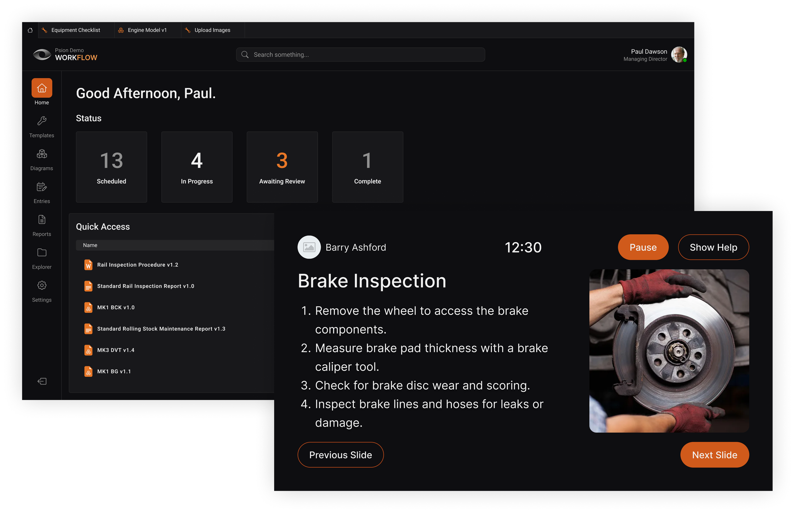
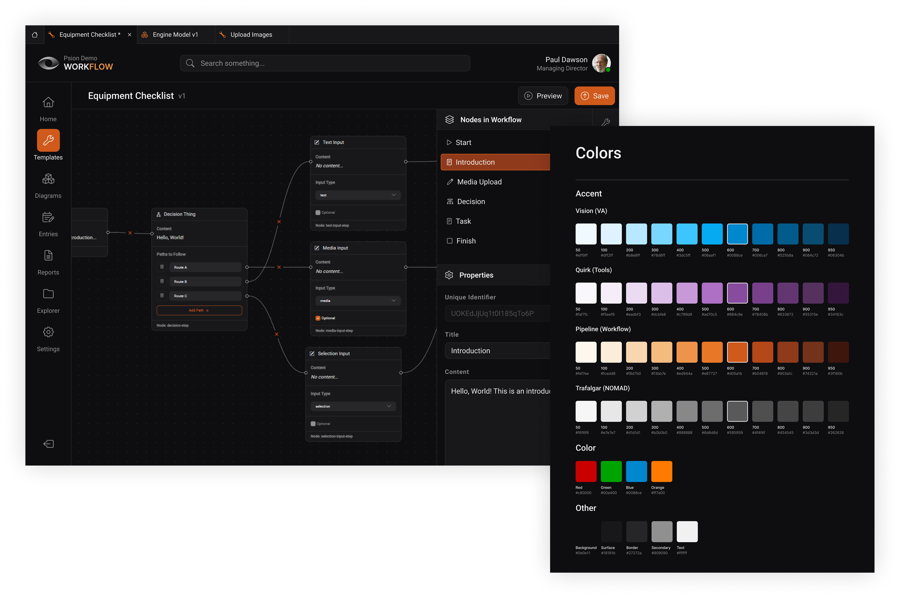

## Overview

WorkflowXR was an augmented-reality workflow management platform built for industrial teams using [**RealWear head-mounted devices**](https://www.realwear.com/). The product allowed organisations to design workflows on desktop, distribute them to wearable devices, and execute them hands-free in the field, including in fully offline environments. It combined workflow authoring, 3D model annotation, offline execution, automatic synchronisation, and PDF reporting into a single system.

This project was my first large-scale professional assignment where I was given full technical ownership as a junior developer. I was responsible not only for architectural decisions and implementation across multiple platforms, but also for all UI/UX design and for coordinating the work of two other developers throughout the full software development lifecycle.

## Problem & Goals

Psion needed a next-generation workflow product to complement its existing AR software. The goal was to replace static, paper-based or disconnected digital procedures with a system that could guide technicians in real time, operate without network access, and automatically generate structured documentation.

Key goals included:

- Authoring workflows with 3D models and annotations.
- Hands-free, voice-controlled execution on AR eyewear.
- Reliable offline operation with deferred synchronisation.
- Support for cloud, secure LAN, and fully offline deployments.
- Automatic PDF reporting after workflow completion.

These goals had to be achieved while integrating with an existing backend and sync system that was not designed for this use case.

## Solution & Architecture

I designed WorkflowXR around an offline-first architecture that could operate across three deployment models: cloud (AWS), LAN-hosted servers, and fully offline eyewear configurations. This ensured the product could function reliably in remote, secure, or disconnected environments.

The system consisted of:

- A **desktop authoring application** ([Tauri](https://v2.tauri.app/), React, TypeScript) for creating and managing workflows and 3D assets.
- An **eyewear execution app** ([Capacitor](https://capacitorjs.com/), React, TypeScript) optimised for voice-only interaction.
- A **backend layer** using AWS services for storage, authentication, scheduling, and synchronisation.

A key architectural decision was to avoid rewriting Psion's existing sync infrastructure. Instead, I designed an isolated, WorkflowXR-specific file-sync service to avoid destructive behaviour while remaining compatible with legacy systems.

## Development Highlights

- Acted as the sole UI/UX designer for the desktop application, designing the full user experience from first principles.
- Created **PsionUI**, a reusable design system and component library for the desktop app, intended to unify the look and feel of all new and existing Psion applications over time.
- Led development of the desktop workflow editor, data models, and local-first file handling.
- Built the eyewear application for hands-free execution, including offline workflow progression.
- Replaced legacy WebView camera access with a custom Capacitor plugin using Android's Camera 2 API, eliminating overheating issues and media corruption on RealWear devices.
- Coordinated development work across two other developers while remaining hands-on in all core areas.

## Platform Experimentation: Vuzix M400

During development, we explored a potential port of WorkflowXR to the [**Vuzix M400**](https://www.vuzix.com/products/m400-smart-glasses), targeting an untapped customer segment outside the RealWear ecosystem. While both devices shared an Android base, the interaction model differed significantly. Unlike RealWear's robust, purpose-built voice engine, Vuzix relied primarily on a haptic touch bar, which introduced a clear UX conflict for a product, and company, built around fully hands-free operation.

To address this, I designed and prototyped a custom on-device voice interaction system using [**Vosk speech-to-text models**](https://alphacephei.com/vosk/) combined with native Android accessibility APIs. This allowed users to control the UI entirely by voice; invoking buttons by name, issuing navigation commands such as "go back," and interacting with the application without touch input.

Although exploratory in nature, the prototype performed reliably and demonstrated that Psion's hands-free workflow model could be extended to alternative hardware platforms without compromising its core UX principles.

## Testing, Delivery & Demos

Testing focused heavily on real hardware due to performance and thermal constraints. In addition to unit and UI testing, extensive manual testing was performed on physical devices to validate voice interaction, offline behaviour, and device stability.

I set up CI/CD pipelines using GitHub Actions and maintained versioned builds for internal testing, customer pilots, and live demonstrations. I was directly involved in demonstrating the software to prospective clients and stakeholders, including defence organisations such as the **British Army**. These sessions often required adapting the product to specific use cases and answering detailed technical and operational questions in real time.

WorkflowXR was also showcased publicly at industry and innovation events, including [**Venturefest 2024**](https://venturefestsouth.co.uk/), where I co-hosted a demonstration stall alongside the Managing Director. This involved presenting the product to a non-technical audience, explaining its value proposition, and gathering early market feedback under live conditions.

## Challenges

WorkflowXR faced significant non-technical challenges:

- **Legacy constraints:** Integration with an inflexible backend and sync system.
- **Hardware limitations:** No support for native AR frameworks such as ARCore.
- **Scope creep:** Features were marketed before being fully developed, driving constant reprioritisation.
- **Organisational instability:** Financial pressure and unclear priorities limited long-term delivery.

To introduce structure, I implemented a lightweight SDLC framework including a development plan, GitHub-based task tracking, standardised Git workflows, and CI/CD documentation.

## Outcome

WorkflowXR did not reach a stable commercial release during my time on the project. While a functional end-to-end platform and multiple working prototypes were delivered, sustained scope creep and organisational constraints prevented the product from being hardened for production.

Despite this, the project resulted in a reusable technical foundation, successful integration with existing systems, and proven offline-first AR workflow execution on constrained hardware.

## Reflection

WorkflowXR was my first experience owning the software development lifecycle end-to-end and understanding where and why complex systems can fail. Being given full technical ownership as a junior developer exposed me early to architectural trade-offs, legacy constraints, delivery risk, and organisational failure modes that are rarely visible in smaller or more successful projects. While the product itself did not ship, the experience fundamentally reshaped how I approach software engineering: success depends as much on scope control, communication, and process as it does on technical execution. By understanding why we do things—and how small decisions can have far-reaching effects—I've become a stronger, more outward-looking, and disciplined developer.
