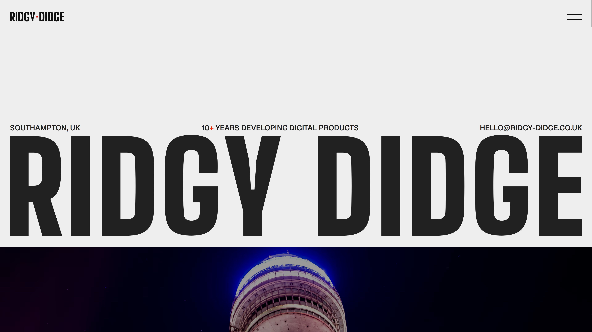
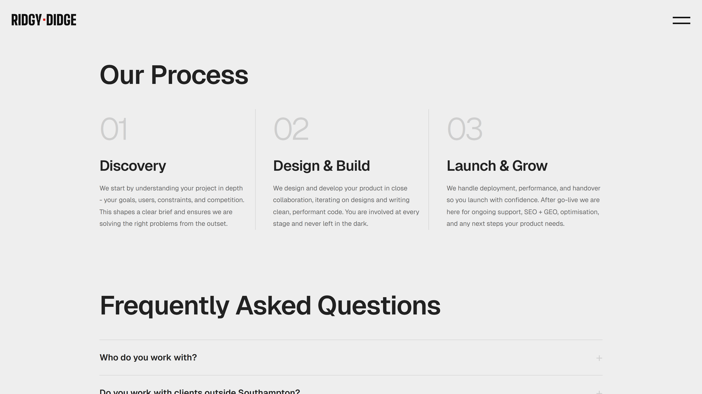
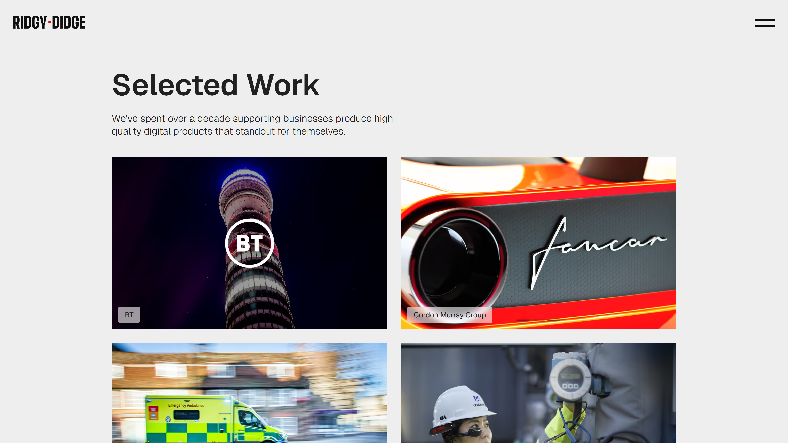

## Overview

Ridgy Didge is a web and software house based in Southampton, UK, delivering digital products for clients ranging from NHS and Vodafone to growing startups and local businesses. I joined the team as a developer in October 2024 and took on the design and build of the company website.

The goal was a content-driven portfolio site that accurately represents the quality of work delivered to clients and performs well in both traditional and AI-driven search.

## Design

The site needed to communicate Ridgy Didge's services and process clearly, showcase selected client work, and convert visitors into enquiries. The design prioritised clean layout and clear hierarchy, with the case study section as the primary trust signal given the calibre of clients the company has worked with.

I also contributed to the visual direction for the site, covering the logo, colour palette, and typography.

## Development

The site was built with [**Astro**](https://astro.build/) for its near-zero JavaScript overhead and strong build-time performance, well suited to a static content-heavy site with strict Core Web Vitals requirements.

Key decisions included:

- **Astro Content Collections** for structured case study management.
- **Static-first generation** with vanilla TypeScript for targeted interactivity.
- **JSON-LD structured data** for enhanced visibility in search engines and AI surfaces, directly reflecting the GEO services offered to clients.
- **PWA support** via a service worker for offline resilience and installability.

