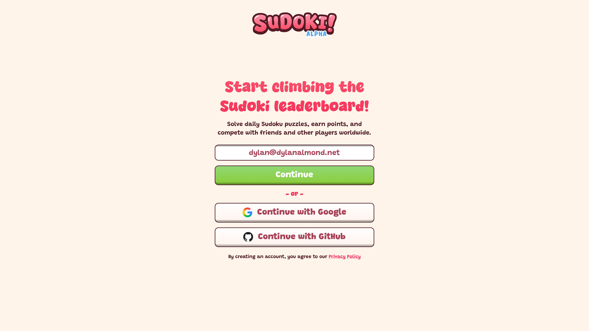
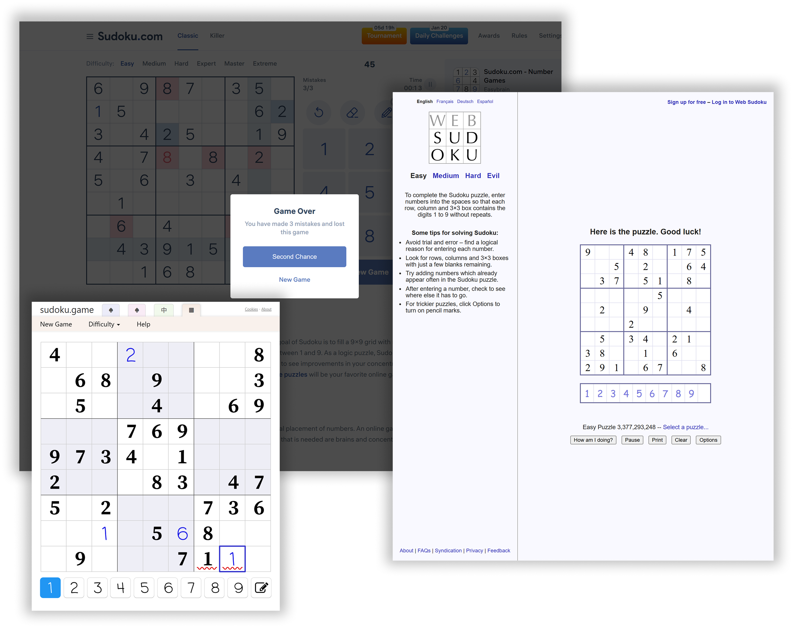
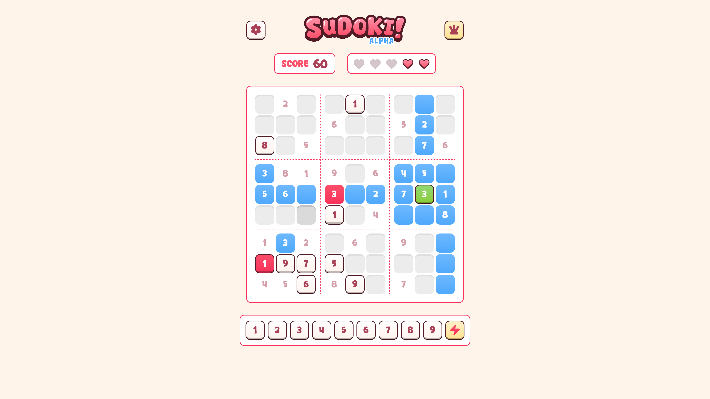
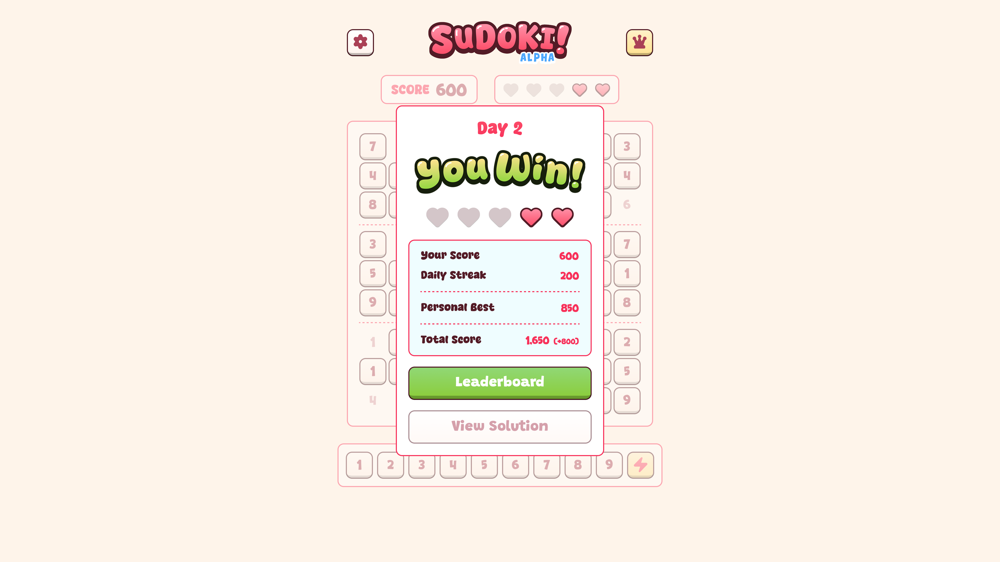
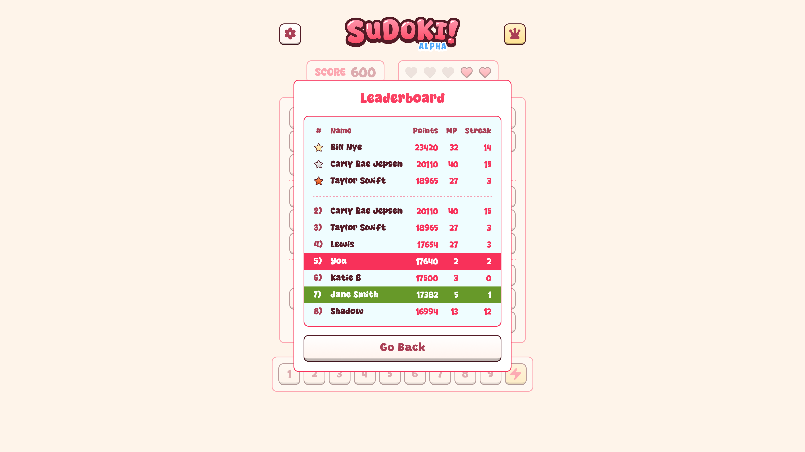

## Overview

Sudoki is a web-based Sudoku game built around a **single daily puzzle**. Players earn points for every valid placement, while **lives limit mistakes**—each invalid placement deducts a life and reduces the score. Daily **streak bonuses** reward persistence, encouraging players to return while staying competitive.

Because all players tackle the **same daily puzzle**, the difficulty remains consistent. This allows the game to challenge players without punishing mistakes harshly, keeping the experience fair and encouraging.

## Problem

Many Sudoku apps overwhelm users with clutter, endless modes, or harsh penalties for mistakes. Players need a system that is **challenging but fair**, rewarding effort and persistence while keeping them engaged and motivated to return daily.

## Solution

Sudoki balances challenge and encouragement through a **risk/reward scoring system**:

- Every valid placement increases the player’s score
- Invalid placements **cost a life and reduce the score**
- Players can continue solving as long as they have lives
- Daily streak bonuses reward consistency

Because the **daily puzzle is the same for everyone**, difficulty is consistent, letting players compete fairly without feeling punished. The shared daily puzzle also encourages **friendly competition** while keeping the experience motivating and fun.

## Design

The interface is **minimal and focused**. The puzzle grid dominates the screen, and feedback for invalid placements is clear but unobtrusive.

Responsive design ensures the game works on both desktop and mobile. By combining **score, lives, and streak bonuses**, the game encourages persistence, habit formation, and friendly competition without clutter or frustration.

## Technical Features

Sudoki is built with **Next.js, Firebase, and CSS**, and designed for both smooth, accessible gameplay and secure competition.

- **Server-side match validation and anti-cheat** ensures scores are accurate and fair.
- **Offline data syncing** allows users to link existing progress to a new account and compete publicly without losing their streaks or score.
- **Responsive design** guarantees a seamless experience on mobile and desktop.
- **Multi-input support** (touch, keyboard, mouse) makes the game accessible to a wide range of players.

## Outcome

Sudoki delivers a **daily puzzle experience that’s challenging and encouraging**. The risk/reward mechanic creates tension, while streaks and positive scoring promote engagement. Shared daily puzzles ensure **consistent difficulty**, making competition fair and motivating players to return daily to improve scores and maintain streaks.

## Next Steps

Future iterations could include:

- Difficulty tiers to challenge advanced players
- Extended progression and personalized scoring
- Optional notifications to increase daily engagement
- Social features like friend challenges or cooperative puzzles
